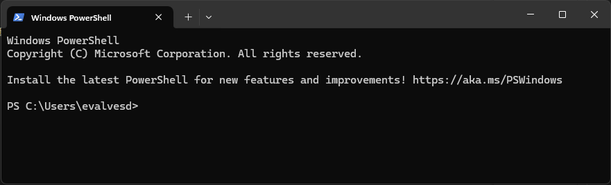
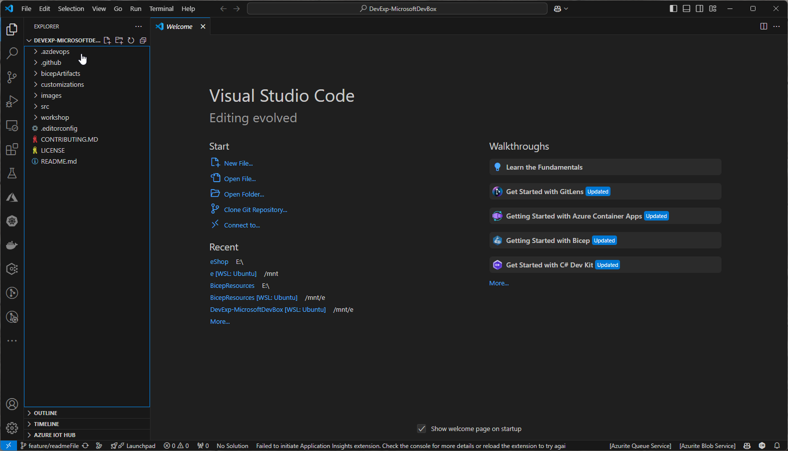
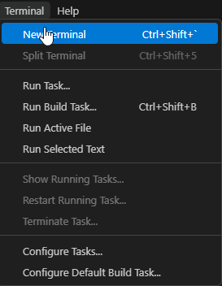
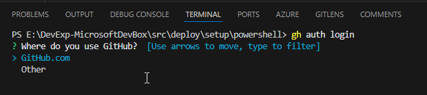
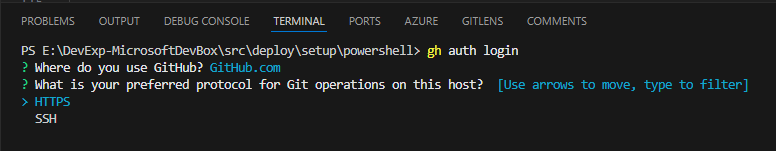
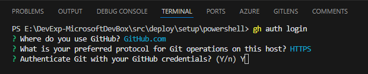
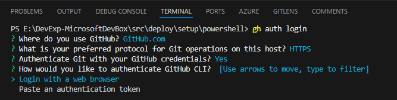
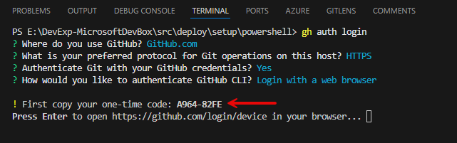
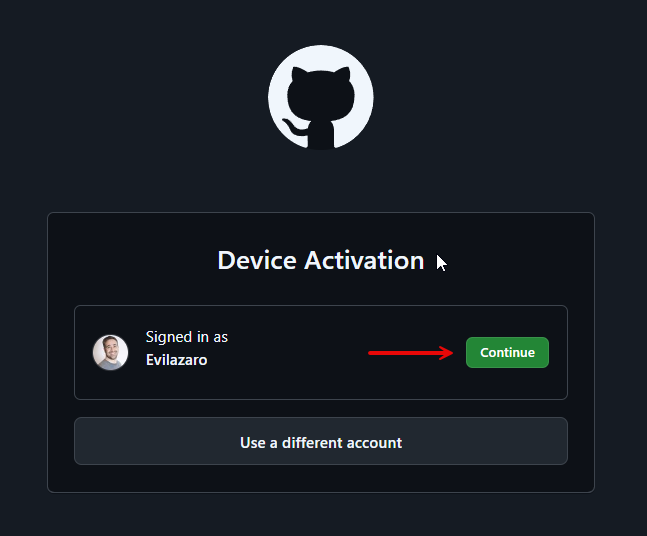
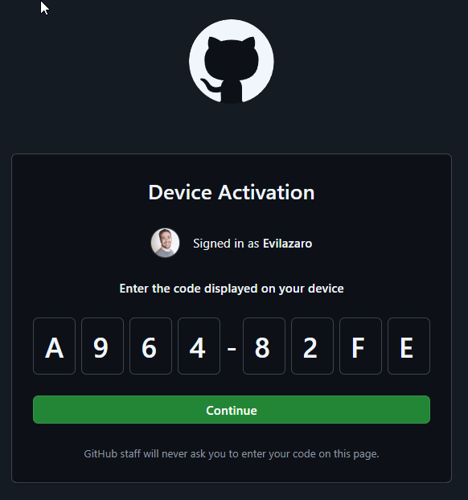

# Dev Experience with Microsoft DevBox

Welcome to the Dev Experience with Microsoft DevBox repository! This repository demonstrates how to deploy Microsoft DevBox for Contoso's Software Development Engineers to expedite their onboarding process and streamline project integration.

## Build and Deploy Status

| Build | Deploy |
|:-----:|:------:|
| [](https://github.com/Evilazaro/MicrosoftDevBox/actions/workflows/testLoginToAzure.yaml) [](https://github.com/Evilazaro/MicrosoftDevBox/actions/workflows/devBox-CI.yaml) | [](https://github.com/Evilazaro/MicrosoftDevBox/actions/workflows/deployDevBox.yaml) [](https://github.com/Evilazaro/DevExp-MicrosoftDevBox/actions/workflows/cleanUpDeployment.yaml) [](https://github.com/Evilazaro/DevExp-MicrosoftDevBox/actions/workflows/devExpNewRelease.yaml) |


## Table of Contents

- [Overview](#overview)
    - [Contoso](#contoso)
    - [Microsoft DevBox Overview](#microsoft-devbox-overview)
- [Solution Architecture](#solution-architecture)
- [Getting Started](#getting-started)
    - [Prerequisites](#prerequisites)
    - [Deployment](#installation)
- [Contributing](#contributing)
- [License](#license)

## Overview

### Contoso
Contoso aims to enhance the developer experience by leveraging Microsoft DevBox. This repository provides a comprehensive guide and resources to deploy and manage Microsoft DevBox environments efficiently.

### Microsoft DevBox Overview

Microsoft DevBox is a cloud-based service that provides pre-configured, secure, and scalable development environments. It allows developers to quickly set up and start coding without worrying about the underlying infrastructure. DevBox integrates seamlessly with Azure services, providing a robust platform for development and testing.

For more information, please refer to the official Microsoft DevBox documentation:
- [Microsoft DevBox Overview](https://docs.microsoft.com/en-us/azure/dev-box/overview)
- [Getting Started with Microsoft DevBox](https://docs.microsoft.com/en-us/azure/dev-box/get-started)
- [Microsoft DevBox Pricing](https://azure.microsoft.com/en-us/pricing/details/dev-box/)

## Solution Architecture


## Getting Started

Follow these instructions to get a copy of the project up and running on your local machine for development and testing purposes.

### Prerequisites

- [Azure Subscription](https://azure.microsoft.com/en-us/free/)
- [Azure CLI](https://docs.microsoft.com/en-us/cli/azure/install-azure-cli)
- [Bicep CLI](https://docs.microsoft.com/en-us/azure/azure-resource-manager/bicep/install)
- [GitHub CLI](https://cli.github.com/)
- [Azure Developer CLI](https://learn.microsoft.com/en-us/azure/developer/azure-developer-cli)
- [Visual Studio Code](https://code.visualstudio.com/)
- [Git](https://git-scm.com/)

### Deployment

1. **Fork the repository:**

    Navigate to the GitHub repository page and click on the "Fork" button at the top right corner of the page. This will create a copy of the repository under your GitHub account.

2. **Clone your forked repository:**

    On Windows, open the Terminal App.

    
    
    Type the following command line:

    Bash or PowerShell
    ```sh
    git clone https://github.com/<your-username>/MicrosoftDevBox.git
    cd MicrosoftDevBox
    code .
    ```

    Visual Studio Code will open as showed below.
    
    
   
2. **Login to Azure:**

    Click on "Terminal" menu and start a new Terminal.

    

    A new terminal will be started according with your terminal preferences. If you running VS Code on Windows, you problably will get a PowerShell Terminal but don't worry, I will explay how to set up the environment using PowerShell and Bash scripts.
    
    Bash or PowerShell
    ```sh
    az login --use-device-code

    gh auth login

    ```

    Select the GitHub.com option and press enter:

    

    Select HTTPS and press enter:

    

    Type Y and press enter:

    

    Select the "Login with a web browser" option and press enter:

      

    Copy the code generated to your clipboard and press enter to open the browser:

    

    In the browser, click on the "Continue" button and paste the code on the text boxes:

    

    Clique on the "Continue" button and you will be authenticated.

    

3. **Set up your credentials for the GitHub Actions**
    
    Bash
    ```sh
    cd src/deploy/setup/bash/
    ./setUp.sh
    ```

    Outcome:


    PowerShell
    ```powershell
    cd src\deploy\setup\powershell
    .\setUp.ps1
    ```

    Outcome:

    The outcome must see like the following:

    ```cmd
    cd evi
    ```

## Contributing

We welcome contributions to enhance the Dev Experience with Microsoft DevBox. Please follow the [contributing guidelines](CONTRIBUTING.md) to submit your changes.

## License

This project is licensed under the MIT License - see the [LICENSE](LICENSE) file for details.