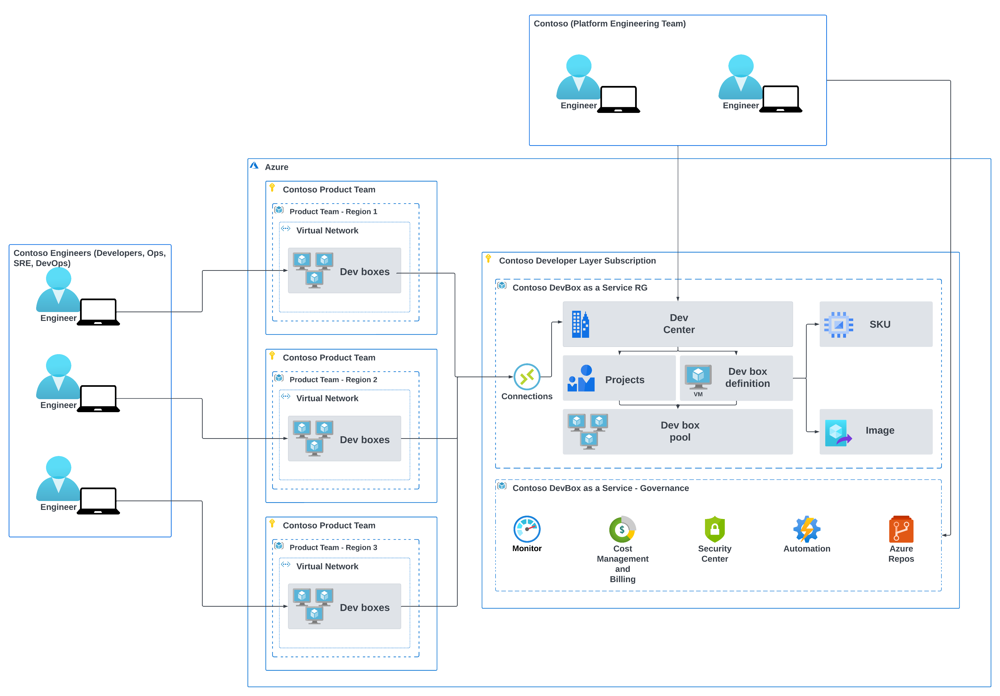

# Welcome to Developer Experience with Microsoft DevBox

# Developer Experience with Microsoft DevBox
## Introduction

This epository provides a collection of scripts to automate the provisioning and deployment of Microsoft DevBox environments in Azure.

## Action Workflows Status

### Build

  

### Deployment 

 

## Solution Architecture

